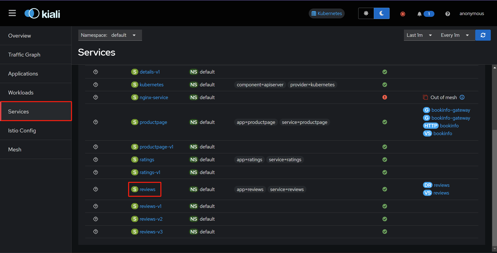
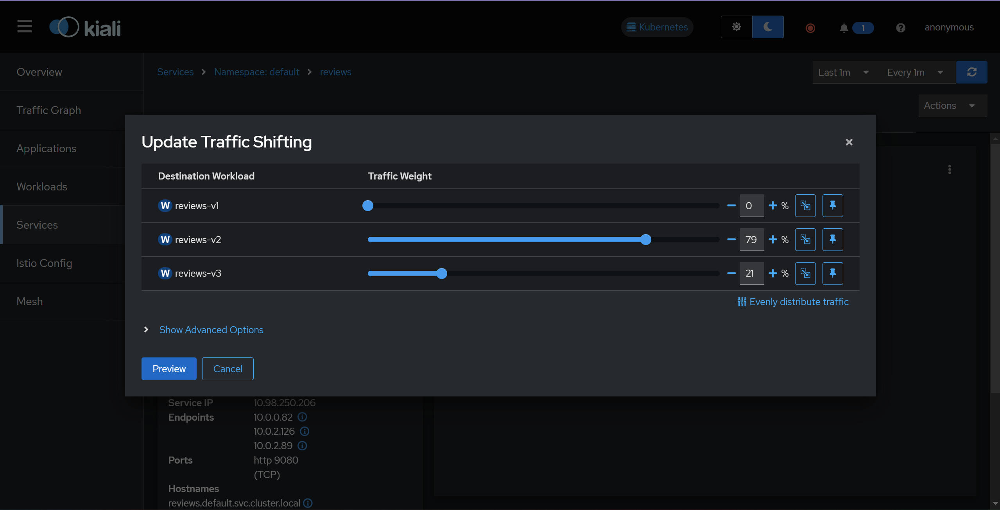
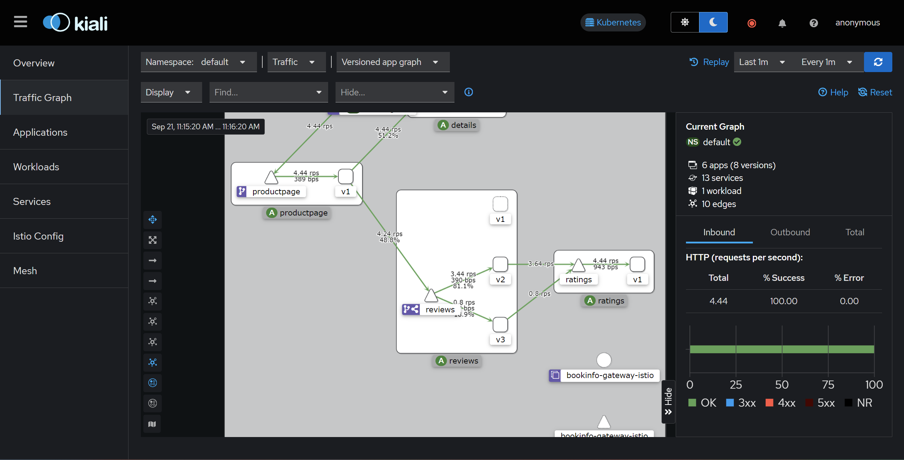

# istio安装

## 前言

### Ambient和Sidecar两种模式

[Ambient还是Sidecar？](https://istio.io/latest/docs/overview/dataplane-modes/)

Ambient支持所有Sidecar的功能，而且不需要为每个pod运行一个附属容器，只需要在每个节点启动一个CNI的容器，这可以节省很多资源同时拥有更高的性能，于2022年发布，但是目前没有在足够的生产集群上应用过。

### cilium网络的单独配置

如果希望使用istio的Ambient模式（使用CNI而不是每个容器增加一个容器），而容器网络使用cilium的网络，那么需要在安装的时候指定`--set cni.exclusive=false`，否则cilium将会阻止istio对CNI配置的更改。

## istio安装

### Ambient模式

[helm安装和卸载Ambient模式的istio](https://istio.io/latest/docs/ambient/install/helm/)

#### 安装控制平面

添加镜像仓库

```shell
helm repo add istio https://istio-release.storage.googleapis.com/charts
helm repo update
```

安装基础组件CRD和集群角色

```shell
helm install istio-base istio/base -n istio-system --create-namespace --wait
```

安装或者升级kubernetes gateway API CRD

```shell
kubectl get crd gateways.gateway.networking.k8s.io &> /dev/null || \
  { kubectl apply -f https://github.com/kubernetes-sigs/gateway-api/releases/download/v1.1.0/standard-install.yaml; }
```

安装控制平面

```shell
helm install istiod istio/istiod --namespace istio-system --set profile=ambient --wait
```

安装CNI

```shell
helm install istio-cni istio/cni -n istio-system --set profile=ambient --wait
```

#### 安装数据平面

ztunnel节点代理组件

```shell
helm install ztunnel istio/ztunnel -n istio-system --wait
```

ingress（可选）

> ingress运行依赖于LoadBalancer!

```shell
helm install istio-ingress istio/gateway -n istio-ingress --create-namespace --set defaults.imagePullPolicy=IfNotPresent --wait
```

#### 测试Ambient模式

[部署bookinfo程序](https://istio.io/latest/docs/ambient/getting-started/deploy-sample-app/)


部署应用程序

```shell
kubectl apply -f https://raw.githubusercontent.com/istio/istio/release-1.23/samples/bookinfo/platform/kube/bookinfo.yaml
kubectl apply -f https://raw.githubusercontent.com/istio/istio/release-1.23/samples/bookinfo/platform/kube/bookinfo-versions.yaml
```

配置入口网关

```shell
kubectl apply -f https://raw.githubusercontent.com/istio/istio/release-1.23/samples/bookinfo/gateway-api/bookinfo-gateway.yaml
```

检查网关运行状态

```shell
$ kubectl get gateway
NAME               CLASS   ADDRESS                                            PROGRAMMED   AGE
bookinfo-gateway   istio   bookinfo-gateway-istio.default.svc.cluster.local   True         42s
```

##### 访问应用程序

```shell
kubectl port-forward svc/bookinfo-gateway-istio 8080:80
```

##### 配置ingress访问

```shell
kubectl apply -f - <<EOF
apiVersion: networking.istio.io/v1beta1
kind: Gateway
metadata:
  name: bookinfo-gateway
spec:
  selector:
    istio: ingress
  servers:
  - port:
      number: 80
      name: http
      protocol: HTTP
    hosts:
    - "192.168.0.220"  # 负载均衡器 IP
---
apiVersion: networking.istio.io/v1beta1
kind: VirtualService
metadata:
  name: bookinfo
spec:
  hosts:
  - "192.168.0.220"   # 修改为你 Ingress 的 EXTERNAL-IP
  gateways:
  - bookinfo-gateway
  http:
  - match:
    - uri:
        prefix: /productpage
    - uri:
        prefix: /static
    route:
    - destination:
        host: productpage
        port:
          number: 9080
EOF
```

### Sidecar模式

[istio Sidecar模式安装](https://istio.io/latest/docs/setup/install/)


## 模式

Ingress是Kubernetes的入口资源处。

Gateway是istio提供入口控制，处理外部流量入口，定义流量的入口规则，比如暴露HTTP或TCP

VirtualService定义路由规则，决定流量的去向，定义流量如何从一个服务到另一个服务

DestinationRule为目标服务提供更细粒度的连接管理和策略控制，定义目标端的策略，决定到达目标后服务的行为和策略。

Gateway → VirtualService → DestinationRule

### 控制服务权重占比实现灰度

```yaml
apiVersion: networking.istio.io/v1
kind: DestinationRule
metadata:
  labels:
    kiali_wizard: traffic_shifting
  name: reviews
  namespace: default
spec:
  host: reviews.default.svc.cluster.local
  subsets:
  - labels:
      version: v1
    name: v1
  - labels:
      version: v2
    name: v2
  - labels:
      version: v3
    name: v3
---
apiVersion: networking.istio.io/v1
kind: VirtualService
metadata:
  labels:
    kiali_wizard: traffic_shifting
  name: reviews
  namespace: default
spec:
  hosts:
  - reviews.default.svc.cluster.local
  http:
  - route:
    # v1版本不要有任何流量
    - destination:
        host: reviews.default.svc.cluster.local
        subset: v1
      weight: 0
    # v2版本占80%流量
    - destination:
        host: reviews.default.svc.cluster.local
        subset: v2
      weight: 80
    # v3版本占20%流量
    - destination:
        host: reviews.default.svc.cluster.local
        subset: v3
      weight: 20
```

### kiali页面实现






图表展示



### 控制流量转发

```yaml
kubectl apply -f - <<EOF
apiVersion: networking.istio.io/v1alpha3
kind: Gateway
metadata:
  name: hello-gateway
spec:
  selector:
    istio: ingress # use the default IngressGateway
  servers:
  - port:
      number: 80
      name: http
      protocol: HTTP
    hosts:
    - "www.vvar.com"
    - "192.168.0.220"

---
apiVersion: networking.istio.io/v1alpha3
kind: VirtualService
metadata:
  name: frontend-ingress
spec:
  hosts:
  - "www.vvar.com"
  - "192.168.0.220"
  gateways:
  - hello-gateway
  http:
  - route:
    - destination:
        host: productpage.default.svc.cluster.local
        port:
          number: 9080
---
apiVersion: networking.istio.io/v1alpha3
kind: DestinationRule
metadata:
  name: bookinfo-destination
  namespace: default
spec:
  host: reviews.default.svc.cluster.local  # 内部服务的 FQDN 此字段和VirtualService进行绑定 也就是VirtualService的FQDN 且只能是FQDN
  subsets:
  - name: v1
    labels:
      version: v1
  - name: v2
    labels:
      version: v2
  - name: v3
    labels:
      version: v3
---
apiVersion: networking.istio.io/v1beta1
kind: VirtualService
metadata:
  name: bookinfo
  namespace: default
spec:
  hosts:
  - reviews.default.svc.cluster.local
  http:
  - match:
    - headers:
        version:
          exact: v1  # 如果请求头中带有 version: v1
    route:
    - destination:
        host: reviews.default.svc.cluster.local
        subset: v1  # 路由到 reviews 的 v1 子集
  - route:
    # 路由到v2 and v3 各自50%流量
    - destination:
        host: reviews.default.svc.cluster.local
        subset: v2
      weight: 50
    - destination:
        host: reviews.default.svc.cluster.local
        subset: v3
      weight: 50
EOF
```

验证

```shell
# 带有"version: v1" 输出应该为0
curl -s -H "version: v1" http://192.168.0.220/productpage|grep "glyphicon glyphicon-star"|wc -l
# 不带有"version: v1" 输出应该为9
curl -s http://192.168.0.220/productpage|grep "glyphicon glyphicon-star"|wc -l
```

> 请注意：现在的访问方式是 hello-gateway(对外提供ingress) -> frontend-ingress(virtualService) -> productpage(default/service) -> productpage服务 -> reviews(default/service) -> bookinfo(virtualService) -> bookinfo-destination(DestinationRule) -> revies(pods)

VirtualService是需要配合httproute或者DestinationRule使用的，后两者用来定义不同的版本，也可以说是后端决定流量去哪，VirtualService用来针对service，用host字段绑定对应的service。

当有其他服务请求这个service的时候，VirtualService就会生效，开始针对这个请求做各种规则，如验证请求头，流量管控分发，但是流量目的地是在DestinationRule里面定义的，在这个里面通过定义对应的label，他会自动去寻找具有这些标签的pod，然后VirtualService根据匹配的规则发送给DestinationRule，从这里面根据对应的label发送到对应的pod来处理请求。

> 上面的有个问题，在于client是需要对productpage发起请求的，然后通过productpage对reviews发起请求，在上面定义productpage的VIrtualService的位置，没有正确的传递请求头下去，所以如果验证需要服务自己添加验证请求头，client只能验证流量正确的分发到了v2 v3。

